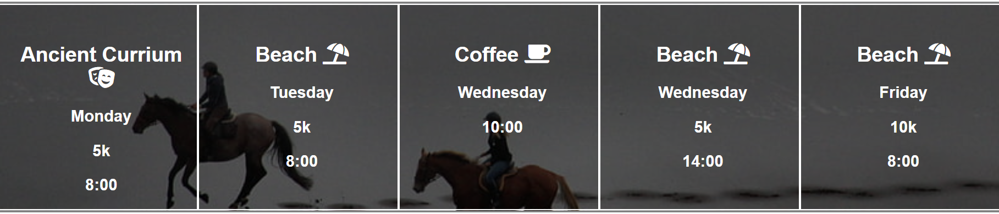
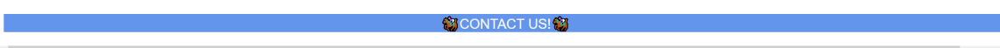
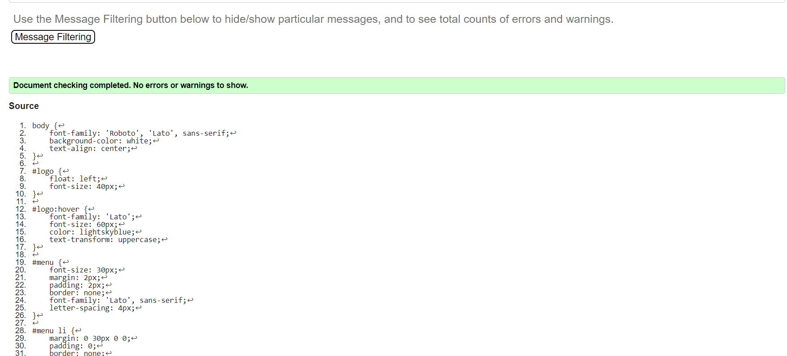

# SuperFunHorseClub.com
This website is targeted towards equastrians that enjoy trail riding and learning more horsemanship. In addition, the purpose of the website is to invite more people to equastrian center, based in Currium, CY, for coffee meet ups. 

 
<h2> Features </h2>

- Navigation Bar 
    - Gallery button
        - Takes the user to the gallery to see photos of our clients and horses.

    - Home button
        - Takes user back to the homepage when they are in the gallery.
    
    - About us

        -  Brief information about the Harry. The man who opened the stables.
    
    - Meetup times

      - This section shows the user what time the meet up start and how far the rides are.
      - This section will get updated often to ensure the user is up to date.
    
    - Footer

       - When the user clicks on the footer, a pop-up notification shows up with a phone number, if the user wishes to find out more. 
<h3>Feature Left to Implament</h3>

- Sign up form
  - A form people can sign up to if they wish to receive notifications about their lessons or trail rides. 

 

<h2>Testing</h2>

Have test the website on multiple web browesers
  - Chrome 
    - Works perfectly
  - Firefox
    - Works perfectly
  - Microsoft Edge
    - Works perfectly

- HTML Validator
    
    - The HTML validator did not find any errors in the code  
- CSS Validator
 
  - The CSS validator did not fina any erros in the code     

 

<h2>Deployment</h2>

- The site was deployed to GitHub pages. The steps to deploy are as follows:
  -  In the GitHub repository, to the Settings tab
  -   From the source section drop-down menu, selected the Main Branch
  -    Once the main branch was selected, the page was automatically refreshed with a detailed ribbon display to indicate the successful deployment.
       - Link: https://nikolmichaelidou.github.io/CI-Project-1/    

 

<h2>Credit</h2>

In this section I will be refrencing my sources.

<h3>Content</h3>

- Icons were taken from FontAwesome.com
- CSS media queries were taken from this tutorial: https://www.w3schools.com/css/css_rwd_mediaqueries.asp

<h3>Media</h3>

- Photos in the gallery were sent to me, throught a facebook group, about horse riding in Cyprus.
